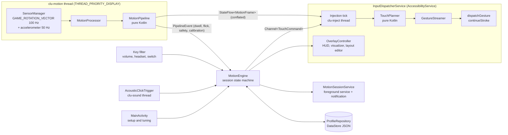

# Clu — architecture and engineering notes

Clu turns device motion into touch input over any Android game, for players with motor
disabilities (cerebral palsy, spinal cord injury, muscle weakness, tremor). This document covers
the system design, the signal pipeline, how continuous touch injection works, the latency budget,
and how permissions are handled.

- [1. System architecture](#1-system-architecture)
- [2. Signal pipeline](#2-signal-pipeline)
- [3. Accessibility features and where they live](#3-accessibility-features-and-where-they-live)
- [4. Touch injection engine](#4-touch-injection-engine)
- [5. Overlay HUD](#5-overlay-hud)
- [6. Background persistence](#6-background-persistence)
- [7. Minimising touch-injection latency](#7-minimising-touch-injection-latency)
- [8. Permissions and platform policy](#8-permissions-and-platform-policy)
- [9. Testing, verification status and limitations](#9-testing-verification-status-and-limitations)

---

## 1. System architecture

One process, five components. Everything stateful lives in `MotionEngine`; the Android
components are thin, restartable views over it.



| Component | File | Responsibility |
|---|---|---|
| `MotionProcessor` | `sensor/MotionProcessor.kt` | Sensor selection and fallback, sensor thread, display-rotation tracking, publishing frames |
| `MotionPipeline` | `core/MotionPipeline.kt` | Per-sample DSP: neutral → control axes → spasm gate → tremor filter → response curve → stick; dwell, flick and safety detectors |
| `MotionEngine` | `engine/MotionEngine.kt` | Session lifecycle (Stopped / Active / Paused), trigger → action routing, key filter, notices, profiles |
| `InputDispatcherService` | `input/InputDispatcherService.kt` | Accessibility service: injection tick, key filtering, foreground-app gate, hosts the overlay |
| `TouchPlanner` + `JoystickDriver` | `core/input/TouchPlanner.kt` | Pure multi-touch planner (stroke continuation rules, back-pressure, taps, camera re-grip) |
| `GestureStreamer` | `input/GestureStreamer.kt` | Turns plans into `StrokeDescription.continueStroke` chains and dispatches them |
| `OverlayController` | `overlay/OverlayController.kt` | `TYPE_ACCESSIBILITY_OVERLAY` HUD, touch visualizer, layout editor |
| `MotionSessionService` | `service/MotionSessionService.kt` | Foreground service (keep-alive, microphone type, notification controls) |
| `MainActivity` | `ui/MainActivity.kt` | Setup checklist, live preview, tuning, bindings |

**Why the split matters.** The whole signal chain (`core/`) has no Android imports, so 86 JVM
unit tests exercise the real filter, curve, detector, calibration and touch-planning code in
under a second. The Android classes only move data between threads and system services.

### Threads

| Thread | Priority | Owns |
|---|---|---|
| `clu-motion` | `THREAD_PRIORITY_DISPLAY` | Sensor callbacks, the entire pipeline (single-threaded, lock-free) |
| `clu-inject` | `THREAD_PRIORITY_DISPLAY` | Injection tick, `TouchPlanner`, gesture callbacks (same thread, so no locks) |
| `clu-sound` | `THREAD_PRIORITY_URGENT_AUDIO` | Optional microphone click detector |
| main | — | Accessibility events, key filter, overlay, activity |

Hand-offs are a conflated `StateFlow` (newest frame wins, a slow reader can never back up the
sensor thread) and a bounded `Channel` for discrete commands. Each `MotionProcessor.start()` gets
its own thread, listener and pipeline, so a fast Stop → Start can't let the old thread unregister
the new session's sensors.

---

## 2. Signal pipeline

Per sample, on the sensor thread (`MotionPipeline.process`):

```text
rotation vector ─► quaternion q (device → world)
   │
   ├─ relative to neutral:  q_rel = q_neutral* · q          (any posture is "zero")
   ├─ rotation vector ω = axis·angle of q_rel, degrees        (no gimbal lock, no Euler order)
   ├─ project on control axes: x = ω·ex, y = ω·ey, twist = ω·ez
   │
   ├─► flick detectors (x, y, twist; raw signal)        ─► FLICK_* / TWIST_* pulses
   │
   ├─► spasm gate      freeze on > 350°/s, glide back over 180 ms
   ├─► tremor filter   One Euro (default) or constant-velocity Kalman
   ├─► response map    radial deadzone → per-direction range → curve → anti-deadzone → snap/digital
   │       └─► stick (x, y) ∈ unit disc  ─► dwell detector ─► DWELL_* press/release
   │
   └─► safety monitor  erratic motion, drops (accelerometer), rest timer, fatigue trend
```

### Orientation source

`TYPE_GAME_ROTATION_VECTOR` is the default rather than `TYPE_ROTATION_VECTOR`. Both are fused
(gyro + accelerometer), so neither drifts in pitch or roll, and pitch/roll are what tilt
control uses. The difference is the magnetometer. `ROTATION_VECTOR` uses it to pin yaw, which
also makes it jump near magnetic disturbance: power-wheelchair motors, steel frames, speakers,
magnetic phone mounts. Those are common in this user group. `ROTATION_VECTOR` is one toggle away
("Use compass…") for head-turn (yaw) control in a magnetically clean environment. Fallbacks:
`GRAVITY`, then a low-passed `ACCELEROMETER` (tilt only), for devices without a gyroscope.
Raw gyroscope integration is never used.

`maxReportLatencyUs = 0` turns off sensor-hub batching, which would otherwise add up to
seconds of lag on some devices.

### Control axes (`ControlBasis`)

The stick is driven by projecting the rotation from neutral onto two axes, chosen by mode:

| Mode | X axis ("right") | Y axis ("down") | Use |
|---|---|---|---|
| `GRAVITY_TILT` (default) | horizontal axis that drops the screen's right edge | horizontal axis that lifts the top edge | hand-held, tray/steering-wheel feel in any posture |
| `GRAVITY_TURN` | vertical axis (turn clockwise seen from above) | as above | head-mounted pointers |
| `DEVICE` | screen-up axis | screen-right axis | gravity-independent |
| `LEARNED` | learned from the user's own "right/left" moves | learned "forward/back", orthogonalised | any body part, any mount, compound motions |

Axes are built from gravity measured at calibration, so "right" means "right edge down" whether
the player is upright, reclined in a wheelchair or lying down. They are re-expressed when the
game changes display rotation, so screen-right always stays right.

### Tremor and spasm filtering

- **One Euro filter** (Casiez et al., CHI 2012). An EMA whose cutoff rises with speed:
  `fc = minCutoff + β·|speed|`. At rest it smooths heavily; during deliberate motion it opens up
  and adds little lag. Two choices make it work for tremor:
  - The speed estimate is itself low-passed at `derivativeCutoffHz ≤ 1 Hz`. Tremor
    (4–12 Hz) is mostly removed from that estimate, so the oscillation cannot open the
    filter, while a sustained intentional movement can.
  - Both axes share one cutoff from the 2-D speed, so diagonal movements don't bend.
  - Tested: a 1° 6 Hz tremor is attenuated to < 30 % RMS, and a 10° intentional step reaches
    90 % in < 400 ms (default tuning, `FilterTest`).
- **Kalman (optional).** A constant-velocity model per axis. It lags less on smooth ramps but
  does not adapt to speed.
- **Spasm gate.** Above `spasmSpeedDegPerSec` the output freezes at the last pre-jerk value.
  When the jerk settles (or after 400 ms) it glides to the live value with a smoothstep instead of
  snapping. A spasm never slams the stick, but a real repositioning is still followed.
- **Auto-tuning from tremor.** Each recalibration averages a 1.5 s "hold still" window (one
  sample would bake a tremor peak into neutral) and measures resting tremor RMS, peak, dominant
  frequency and speed. The deadzone widens to `1.5 × RMS` (capped at 6°), and flick thresholds
  rise to 4× RMS amplitude and 3× RMS speed.

### Response mapping (`ResponseMapper`)

1. **Scaled radial deadzone**, in degrees. The output starts at 0 at the deadzone edge, so there
   is no jump when leaving rest.
2. **Per-direction range**. Full deflection at `fullTiltDeg`, or at each learned direction's
   range. Asymmetric ranges support asymmetric motion (e.g. hemiplegia).
3. **Curve on the radial magnitude.** Direction is preserved, so diagonals stay precise.
   - `POWER` (`out = in^γ`): γ < 1 boosts micro-movements, γ > 1 gives fine control near center.
   - `SIGMOID`: a logistic curve normalised through (0,0) and (1,1). A low midpoint gives a soft
     start that then reaches full speed quickly.
4. **Anti-deadzone.** A minimum deflection once outside rest, to jump over the game's own
   joystick deadzone. Without it, small tilts produce nothing.
5. **Direction snapping / digital 4- or 8-way output**, for users who find exact diagonals hard.

---

## 3. Accessibility features and where they live

| Requirement | Implementation |
|---|---|
| Tremor & spasm cancellation | `OneEuroFilter2D`, `KalmanFilter2D`, `SpasmGate` (`core/filter/TremorFilters.kt`); auto-tune from `TremorProfile` |
| Ergonomic zero point | `CalibrationCapture`: settle 0.5 s, then average 1.5 s; retries if the user can't hold still, then accepts and says so. Triggered from the HUD, notification, a key/switch, a flick, or Voice Access ("tap Recenter") |
| Range-of-motion learning | `AxisLearner`: the user moves right/left/forward/back as far as is comfortable. Full deflection is set to 70 % of that, so nobody has to strain to the limit |
| Rest timer / auto-pause | `SafetyMonitor`: rest reminder (optionally enforced), erratic-motion pause (sustained RMS speed or a cluster of severe jerks), drop pause (free fall or impact on the accelerometer), fatigue warning (resting tremor drifting above the calibration baseline) |
| Deadzone & micro-movement boost | `ResponseMapper` + `ResponseCurves` |
| Dwell actions | `DwellDetector`: enter/exit hysteresis, ±30° cardinal tolerance (diagonals never fire), 150 ms grace so tremor dips don't restart the timer, progress ring on the HUD. HOLD bindings press on fire and release when leaving the zone ("hold forward 1.2 s = sprint while held") |
| Gesture snapping (flicks) | `FlickDetector`: speed + amplitude window + out-and-back within 450 ms + refractory period. Twist flicks are the default because they don't move the stick |
| Switch / key / headset | `onKeyEvent` key filter. USB/Bluetooth switch interfaces (Space/Enter), volume keys, wired headset hook; learnable bindings; keys are only consumed while they mean something (volume works normally when stopped or paused) |
| Sound click | `AcousticClickTrigger` + `ClickOnsetDetector`: ≥ 15 dB above an adaptive noise floor and ≤ 150 ms long. Speech and game audio are rejected; levels only, nothing is recorded |
| Hands-free resume | While paused (not after a drop), dwelling in any direction resumes. After any resume the stick stays locked until it has been at neutral once, so resuming never lurches the character |
| Safe by default | Injection is blocked in Clu's own screen, system Settings, permission/installer screens and launchers (`ForegroundAppGate`); no auto-resume after a drop; `START_NOT_STICKY`; screen-off pauses and stops the sensors |
| Per-game profiles | Five presets (handheld, strong tremor, small movements, head/lying down, wheelchair mount). "Link game" in the layout editor auto-selects a profile when that game comes to the front |

Every control is reachable at least four ways: touch on the HUD, Voice Access/TalkBack (labelled
standard buttons, live-region status), keys/switches, and notification actions. HUD buttons are
≥ 48 dp with a 3 dp focus ring. The tilt indicator uses shape as well as colour (ring = filtered
tilt, dot = injected stick, arc = dwell progress) and gives screen-reader users a spoken state
description at most once per second.

---

## 4. Touch injection engine

### Why short continued strokes

`dispatchGesture` takes a complete `GestureDescription`, capped at 60 s and fixed before it
starts. A joystick needs an unbounded drag whose direction changes every frame. Dispatching a new
gesture each frame doesn't work: a non-continuing gesture cancels the previous one, so the game
would see `DOWN … CANCEL` every frame and floating joysticks would re-center constantly.

API 26 added `StrokeDescription.continueStroke(path, start, duration, willContinue = true)`.
Clu streams **one ~16 ms segment per tick** for every live pointer, each continuing that
pointer's previous stroke. The result is one gesture of unlimited length that can change
direction every frame.

### Platform rules this is built around

These are checked against `MotionEventInjector` / `GestureDescription` in AOSP (Android 9, 11,
13 and main) and encoded in `TouchPlanner`. Each has a unit test.

1. **Continuations are appended, not cancelling.** While earlier sequences are in progress, a
   continuing gesture's events are scheduled after `mLastScheduledEventTime`. That is what makes
   pipelining possible.
2. **Exact continuation point.** A continuation is accepted only if its first point equals the
   previous stroke's last point after `Math.round`. Clu uses whole-pixel endpoints, so both
   roundings always agree.
3. **Every pointer still down must be continued** by the next gesture. Otherwise the whole
   gesture is rejected and everything in flight is cancelled. The planner always continues all
   live pointers.
4. **The first step of a continuing gesture may contain only continued strokes.** The injector
   counts every touch point at t = 0 against the pointers still down. A new finger (a button
   pressed while the stick moves) is therefore added with `startTime = 1 ms`, after the continued
   strokes, and arrives as `ACTION_POINTER_DOWN` in the same gesture.
5. **A fresh (non-continuing) gesture cancels everything queued.** The planner never starts one
   while anything is in flight; otherwise a tap's `ACTION_UP` would become `ACTION_CANCEL`, which
   games ignore.
6. **Cancellation** (a rejected continuation, or a real touch up to Android 15) invalidates a
   whole generation of strokes. Pointers that should still be down re-press at their press point
   after a 150 ms back-off. The joystick re-presses at its anchor, not mid-drag.
7. **Android 16 changed real-touch handling and stopped telling us.** With
   `motion_event_injector_cancel_fix` (enabled in the Android 16 release config), a real finger no
   longer makes `MotionEventInjector` cancel the injection. Instead, InputDispatcher cancels the
   injected stream *inside the touched window* (one device per window) and drops further
   continued MOVEs as inconsistent, while Clu's gesture callbacks still report success. The stick
   would look alive to Clu but be dead in the game. Clu detects this itself: the HUD window sets
   `FLAG_WATCH_OUTSIDE_TOUCH`, ignores Clu's own injected events (they carry
   `deviceId = KeyCharacterMap.VIRTUAL_KEYBOARD`, verified in AOSP 16), and on a real outside touch
   `TouchPlanner.onExternalTouch` starts a new generation. Held pointers then re-press with a fresh
   DOWN after 300 ms, long enough for a tap to finish, since re-pressing during it would cancel the
   person's own touch. A touch on Clu's HUD is a different window and no longer breaks the drag on
   Android 16.

### Joystick behaviour (`JoystickDriver`)

- **STICK.** Touch down at the anchor first (floating joysticks take their center from the
  down point), then drag to `anchor + deflection × radius`. Lift after resting at neutral for
  `releaseAfterNeutralMs`, or keep holding at center (`holdAtCenter`) for games that reset the
  stick on lift.
- **CAMERA_DRAG.** Rate control for look pads: deflection sets finger velocity. At the pad edge
  the finger lifts and re-grips at the center, the way a thumb does.
- **Buttons.** Tap (timed hold counted from the actual touch-down), hold (while a key or dwell
  is held) and toggle (latched), all as extra pointers in the same gesture stream.

---

## 5. Overlay HUD

`OverlayController` adds windows of type **`TYPE_ACCESSIBILITY_OVERLAY`** using the accessibility
service's own `WindowManager`:

- **No `SYSTEM_ALERT_WINDOW`.** The windows are removed automatically if the service is
  disabled.
- **Trusted overlay.** Android 12+ blocks touches that pass through untrusted
  (`SYSTEM_ALERT_WINDOW`) overlays above 0.8 opacity; accessibility overlays are exempt.
- **HUD panel.** Tilt indicator, status line (live region), and
  Pause/Recenter/Profile/Layout/Learn/Move/Stop/Hide. It collapses to a bubble, and "Move panel"
  cycles through 8 anchors with one tap (no dragging needed). `FLAG_NOT_FOCUSABLE`, so it never
  steals key input from the game. It warns if it covers a configured stick or button, since
  injected touches would land on the panel instead of the game.
- **Touch visualizer** (optional). Full-screen, `FLAG_NOT_TOUCHABLE`, shows targets and the
  virtual fingers.
- **Layout editor.** Full-screen while play is paused. Drag targets onto the game's own
  controls, or use Next/arrow nudges/size buttons, so it is fully operable by switch or voice.
  Full-screen windows set `LAYOUT_IN_SCREEN | LAYOUT_NO_LIMITS`, cutout mode `ALWAYS` and
  `fitInsetsTypes = 0`, so overlay coordinates match `dispatchGesture`'s absolute display
  coordinates.

Rendering is pulled on vsync through a `Choreographer` callback and throttled to ~30 Hz. It stops
entirely when stopped and idle, and nothing is drawn per sensor sample.

---

## 6. Background persistence

- **The accessibility binding already does most of the work.** The system binds accessibility
  services with `BIND_FOREGROUND_SERVICE_WHILE_AWAKE` (`AccessibilityServiceConnection`), so the
  process has foreground-service importance whenever the screen is on.
- **`MotionSessionService`** (foreground service, `specialUse` plus `microphone` when the sound
  trigger is on) adds:
  - resistance to OEM task killers that ignore that importance;
  - continued microphone delivery in the background (Android 11+ "while-in-use" rules);
  - persistent notification controls, reachable by Switch Access and Voice Access.
- **Failure handling.** If Android refuses the FGS start (`ForegroundServiceStartNotAllowedException`)
  the session continues without it and the user is told. If a microphone-type start is refused
  (the app wasn't visible), it falls back to `specialUse` only. `startForeground` always runs
  before anything that could `stopSelf`, because stopping a `startForegroundService` service
  before it is foreground crashes.
- **`START_NOT_STICKY`.** A killed session must never silently come back injecting touches.
- **Force stop switches the service off.** On Android 16, a force stop (App info, phone-cleaner
  tools, and Xiaomi's Ultra battery saver, which force-stops apps) removes Clu from
  `ENABLED_ACCESSIBILITY_SERVICES`. The setup screen remembers that the service once ran
  (`ServiceHealth.TURNED_OFF`) and says so in plain words, instead of a generic "off".
- **A crash leaves the service "enabled but not running".** Android keeps a crashed service in the
  enabled list with nothing bound, and reports from HyperOS 3 / Android 16 say toggling doesn't
  always recover it. Clu therefore contains errors instead of crashing. The injection tick, key
  and window callbacks, the sensor callback, the HUD render and every coroutine scope catch and
  log runtime exceptions, and play pauses with `PauseReason.ERROR`. The setup screen reports
  `ServiceHealth.STUCK` when the service is enabled but unbound for more than 10 s.
- **Xiaomi / HyperOS.** The per-app Battery saver ("No restrictions") is what exempts an app from
  HyperOS's process freezer, not AOSP's Doze allow-list. The setup screen therefore shows a
  Xiaomi checklist with deep links to Battery saver and Autostart, each with a fallback to App
  info. See [POCO_X7_PRO.md](POCO_X7_PRO.md).
- **Screen off.** Pauses, unregisters the sensors and stops the microphone. Doze does not apply
  while the screen is on, so no wake lock and no battery-optimisation exemption are needed.

---

## 7. Minimising touch-injection latency

The motion-to-touch path, with estimated contributions. These are design figures; measure on
target devices, for example with a high-speed camera, or by logging `MotionEvent` timestamps in
a test app against sensor timestamps.

| Stage | Estimate | Lever |
|---|---|---|
| Sensor sampling (100 Hz) + fusion | ~5–10 ms | `samplingPeriodUs`; no batching (`maxReportLatencyUs = 0`) |
| Pipeline compute | < 0.1 ms | Pure arithmetic on one thread |
| Tremor filter group delay during motion | ~30–60 ms | `beta` ("Responsiveness") and `minCutoffHz`. This is the deliberate steadiness/lag trade-off, and the largest term |
| Wait for the next injection tick | 0–16 ms | `segmentMs` |
| Queued segments | ≤ `maxInFlight × segmentMs` (≤ 32 ms) | `maxInFlight` (2) |
| Binder + system_server scheduling | ~1–2 ms | — |

Practices used, and why:

1. **Fused sensor, no batching, elevated sensor thread.** Batching is the single largest
   avoidable delay on many devices.
2. **Conflated hand-off.** A `StateFlow` always carries the newest frame. No queue can build up
   between the sensor thread and injection.
3. **Short continued strokes with bounded in-flight.** Latency stays at about one or two
   frames, and coalescing means a late tick never loses motion: the next segment goes straight to
   the newest target.
4. **Never cancel-and-restart.** Every restart is a DOWN/UP pair the game has to process, and
   floating sticks re-center on it.
5. **Buttons join the stick's gesture** as extra pointers instead of separate dispatches, which
   would cancel the stick.
6. **Speed-adaptive filtering** rather than a fixed heavy low-pass: tremor removal without a
   constant lag tax.
7. **Cheap overlays.** Small panels, 30 Hz throttled rendering, and the full-screen visualizer
   off by default (every full-screen layer adds composition work the game pays for).
8. **No haptics.** Vibrating the phone contaminates the gyroscope signal that is being read.

---

## 8. Permissions and platform policy

| Permission / declaration | Status | Notes |
|---|---|---|
| `BIND_ACCESSIBILITY_SERVICE` | Declared on the service | Ensures only the system can bind it. The user enables it in **Settings → Accessibility**; the app shows status and a deep link |
| Accessibility config | `canPerformGestures`, `canRequestFilterKeyEvents`, `typeWindowStateChanged`, `canRetrieveWindowContent="false"`, `isAccessibilityTool="true"` | The minimum needed: Clu knows which app is in front (package/class) but never reads screen content |
| Restricted settings (Android 13+; Enhanced Confirmation Mode on 15/16) | Guided in-app, ordered steps | APKs opened from a file manager or browser are restricted; `adb install` is not on AOSP-default configs. The **App info → ⋮ → Allow restricted settings** item only appears *after* the user has tried to enable the service and dismissed the block dialog, so the in-app text gives the three steps in order and highlights them when `InstallSourceInfo.packageSource` is a local or downloaded file |
| `isAccessibilityTool="true"` | Declared and unit-tested | Load-bearing on Android 16: without it, injected gestures are dropped at views marked accessibility-data-sensitive (including any using `filterTouchesWhenObscured`), the service can't be enabled during calls with unknown numbers, and PermissionController keeps suggesting its removal |
| `SYSTEM_ALERT_WINDOW` | **Not requested** | `TYPE_ACCESSIBILITY_OVERLAY` covers every overlay need, see below |
| `FOREGROUND_SERVICE`, `FOREGROUND_SERVICE_SPECIAL_USE` | Requested | `specialUse` with a `PROPERTY_SPECIAL_USE_FGS_SUBTYPE` explanation, which Play Console asks you to justify. There is no dedicated "sensor" FGS type, and `health` would be a misuse |
| `FOREGROUND_SERVICE_MICROPHONE`, `RECORD_AUDIO` | Requested; runtime prompt only when the sound trigger is enabled | Microphone FGS must be started while the app is visible |
| `POST_NOTIFICATIONS` (13+) | Runtime prompt from the setup checklist | The FGS runs without it, but its controls would be hidden |
| `REQUEST_IGNORE_BATTERY_OPTIMIZATIONS` | **Not requested** | Restricted by Play policy and unnecessary with the screen on. The app links to `ACTION_IGNORE_BATTERY_OPTIMIZATION_SETTINGS`, or on Xiaomi to the per-app Battery saver, which is what HyperOS actually honours |
| Xiaomi "Display pop-up windows" (and "…while running in the background") | **Not needed** | Accessibility overlays are gated by their own app-op (`OP_CREATE_ACCESSIBILITY_OVERLAY`), not `SYSTEM_ALERT_WINDOW`, and Clu never starts activities from the background |
| `HIGH_SAMPLING_RATE_SENSORS` | Not needed | 100 Hz is below the 200 Hz cap |
| `INTERNET` | **Not requested** | Motion and audio data cannot leave the device |
| `<queries>` HOME intent | Declared | Package visibility on Android 11+, so launchers can be identified and blocked |

**If you ever need `SYSTEM_ALERT_WINDOW`** (for example an overlay that works without the
accessibility service): check `Settings.canDrawOverlays()`, send the user to
`ACTION_MANAGE_OVERLAY_PERMISSION` with your package URI, use `TYPE_APPLICATION_OVERLAY`, keep
pass-through windows at `LayoutParams.alpha ≤ 0.8` (untrusted-touch occlusion, Android 12+), and
remember that on Android 15 it only exempts FGS starts from the background while an overlay
window is actually visible.

**Google Play.** Accessibility API use requires a prominent in-app disclosure and a Play Console
declaration. Clu qualifies as an accessibility tool (`isAccessibilityTool="true"`). Its service
description, in `strings.xml`, states exactly what is done: gestures, foreground app, chosen keys,
and no screen content.

---

## 9. Testing, verification status and limitations

**Automated (JVM, `./gradlew test`, 98 tests).** Quaternion math and control axes across all
four display rotations; filters (tremor attenuation, step response, diagonal integrity, spasm
gate); response curves (monotonic, endpoints, continuity at the deadzone, asymmetric ranges,
digital and snapping); dwell (timing, hysteresis, tremor grace, diagonals); flick (direction,
slow tilt, tremor, move-and-stay, spasm, overshoot); calibration (averaging, tremor profiling,
retry); axis learning (skewed and asymmetric motion, fallback); safety (free fall, impact,
erratic, severe-jerk clusters, rest, fatigue); the touch planner (continuation chaining,
back-pressure coalescing, tap timing, no fresh gesture over an in-flight UP, new strokes delayed
in continuing gestures, cancellation generations, clamping); the joystick driver (anchor
touch-down, release, camera re-grip); real-touch recovery (Android 16); service-health states; the
accessibility-service XML (`isAccessibilityTool`, no window content); injection statistics and
the synthetic self-test; the foreground-app gate; profile JSON compatibility; and
end-to-end pipeline scenarios (tilt to stick, lying-down neutral, resting tremor stays neutral,
dwell, twist flick, axis learning, display rotation, drop). A mutation check confirmed that
breaking the gravity basis sign or the in-flight rule makes tests fail.

**Not yet verified on a device.** The development environment had no hardware virtualisation,
so the Android-side code (sensor registration, `dispatchGesture` streaming, overlays, FGS) was
compiled and linted (Lint and an R8 release build pass) but not run. The injection rules above
come from reading AOSP source, not from observing a device. The app ships its own verification
kit for this: **Injection test** (a stand-in game screen with a synthetic stick-plus-taps run
that needs no sensors) and **Share device report**. The step-by-step device procedure for the
first target phone is in [POCO_X7_PRO.md](POCO_X7_PRO.md). Before relying on it, test:

- streaming drags in a few engines (Unity, Unreal, native/GL) with fixed and floating sticks;
- holding the stick while tapping buttons (rule 4) and releasing them;
- a real finger touching the screen mid-drag (Android ≤ 15: cancellation callback and re-press;
  Android 16: CANCEL in the game window, then a re-press via the HUD's outside-touch watch);
- Android 9, 12, 14 and 16, plus at least one aggressive OEM (Xiaomi, Samsung);
- TalkBack, Voice Access and Switch Access driving the HUD.

**Known limitations.**

- Bluetooth headset buttons arrive through `MediaSession`, not as key events, so the
  accessibility key filter can't see them (wired headset hooks and switch interfaces work).
- Some games or anti-cheat systems ignore or reject injected input.
- Only the default display is supported, and layouts are stored as fractions of the current
  orientation.
- Facial or blink triggers are not implemented. They would plug into the same
  `MotionEngine.onTrigger` route, for example via CameraX + ML Kit face detection in a `camera`-type
  foreground service.
- Dependency versions are a verified-compatible set (AGP 8.13, Kotlin 2.2, compileSdk 36). Moving
  to AGP 9 / API 37 is a separate, deliberate upgrade.
